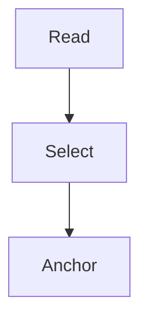

# Synthetic reader checks

This is a **labelled test fixture**, not content from GitHub.

## Selection

A **transaction** groups several database operations into one unit of work.

A 😀 **café** example with Unicode.  
This is a hard line break.

## Java code

```java
int total = debit + credit;
```

## Table and tasks

| Level | Meaning |
| --- | --- |
| Read committed | Only **committed** rows are visible. |

- [x] A completed test item
- [ ] A pending test item

## App-owned image fixture


## Blocked external image


## Mermaid



## Unsafe content is not executed

<script>document.body.dataset.injected = 'yes'</script>

[Unsafe link](javascript:alert)
